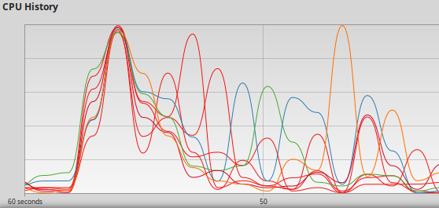

# Distributeur automatique de billets distribué - Support pédagogique

## Architecture et framework

L'application est décrite par des **composants**. Les relations entre composants sont décrites sous formes d'**interfaces** **offertes** ou **requises**. Dans ce modèle simplifié, les interfaces ne contiennent que des **événements**. La réception d'un événement active un traitement qui à sont tour peut déclencher l'émission d'un ou plusieurs événement d'une interface. Les événements sont composés d'un ensemble de **données** de types **scalaire**, **énuméré** ou **agrégat**.

Le méta modèle de ce genre d'application est décrit par un schéma XML (xsd) : [distributed-application.xsd](distributed-application.xsd) et le modèle de cette application est décrit par le document XML : [dab.xml](dab.xml)

La régularité de l'architecture sous-tend la régularité du code, il est donc possible de générer une grande partie de l'application :
- Le code de communication, création, envoi et réception des messages UDP (événements)
- Le code d'activation des acteurs concerné par les événements reçus (routage)

Il a donc été développé quelques bibliothèques de classes (Java et C++) et de fonctions C (sans malloc) afin de :
- Rendre homogène le traitement des messages et des événements quelque soit le langage cible.
- Faciliter le portage entre les OS GNU/Linux et MS-Windows

Ainsi, la génération de code s'appuie sur un modèle commun et par trois modèles `StringTemplate` spécifiques des trois langages cibles.

## Les projets :

- **sc** pour **Site Central** : une application Java qui montre l'état des comptes bancaires et des cartes de crédit
- **udt** pour **Unité de Traitement** : l'application où est implémentée la logique du système, hors IHM
  - Une implantation en C, sans allocation dynamique de mémoire (aucun appel à `malloc`)
  - Une implantation en C++, assez proche de ce qu'on pourrait faire en Java
- **dab** pour **Distributeur Automatique de Billets** : une application Java qui permet l'interaction avec l'utilisateur final

## Logique applicative

La logique applicative dans **Unité de Traitement** est en grande partie décrite par un [automate fini](https://fr.wikipedia.org/wiki/Automate_fini) qui ne couvre que les cas nominaux et quelques cas de panne (Cf. "reste à faire" en fin de page).

## Construire et exécuter les projets :

**Pour les impatients :**
- Version C : `ant boot run-c` 
- Version C++ : `ant boot run-cpp`

Il est nécessaire de disposer de :
- Java, dont la version doit être supérieure ou égale à 8, (OpenJDK 11.0.4 fait l'affaire)
- Compilateur JAXB `xjc`, qu'on installe sous GNU/Linux Debian par `sudo apt install xjc` 
- Compilateur C11 et C++17 (gcc 7.4.0 fait l'affaire)
- [Apache Ant](https://ant.apache.org/)
- [GNU Make](https://www.gnu.org/software/make/)
- Les bibliothèques Java JAXB nécessaires, [qui ne sont plus fournies avec le JDK 11](https://www.jesperdj.com/2018/09/30/jaxb-on-java-9-10-11-and-beyond/) sont dans [lib](lib).

En pas-à-pas, pour comprendre :
1. Générer le code JAXB à partir du schéma [distributed-application.xsd](distributed-application.xsd) : `(cd disappgen && ant jaxb-gen)`
2. Compiler et packager le générateur de code : `(cd disappgen && ant jar)`
3. Générer le code de l'application à partir du document XML [dab.xml](dab.xml) : `ant generate-all-sources` 
4. Compiler dans l'ordre :
   - util-c : `(cd util-c && make)`
   - udt-c : `(cd udc-c && make)`
   - util-cpp : `(cd util-cpp && make)`
   - udt-cpp : `(cd udc-cpp && make)`
   - util-java : `(cd util-java && ant)`
   - sc : `(cd dc && ant)`
   - dab : `(cd dab && ant)`

La cible `build-all` de [build.xml](build.xml) décrit les dépendances entre binaires et donc le parallélisme optimal pour produire l'application.

    <target name="build-all">
       <parallel>
          <sequential>
             <antcall target="util-c" />
             <antcall target="udt-c" />
          </sequential>
          <sequential>
             <antcall target="util-cpp" />
             <antcall target="udt-cpp" />
          </sequential>
          <sequential>
             <antcall target="util-java" />
             <parallel>
                <antcall target="dab" />
                <antcall target="sc" />
             </parallel>
          </sequential>
       </parallel>
    </target>

Temps passé à produire :
- real  0m12,026s
- user  0m22,053s
- sys   0m1,970s

A comparer avec la solution en série :

- real  0m15,277s
- user  0m18,172s
- sys   0m1,854s

## Reste à faire

1. Il n'existe pas de gestion des temporisations : impact sur les librairies et le framework.
2. Compléter l'automate car il est possible d'être grandement à découvert : il n'y a pas de limite aux retraits effectués (Youpi !).
3. L'IHM du **Distributeur Automatique de Billets** ne montre pas les cartes confisquées ni les billets qui n'ont pas été pris par l'utilisateur.
