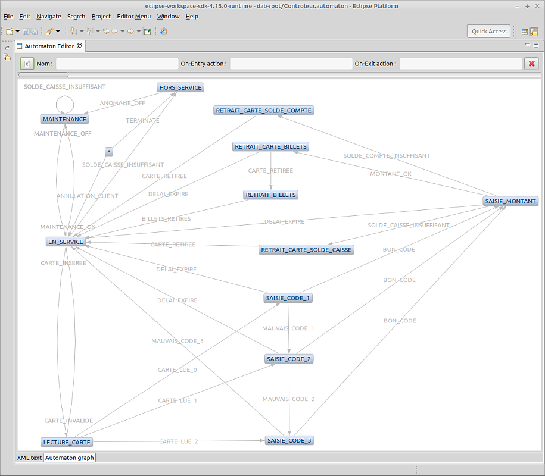

# Automaton Eclipse plugin #

L'éditeur présente deux onglets :
- `XML text` : pour une édition textuelle, avec le support de la coloration syntaxique et de la complétion sur la base du schéma.
- `Automaton graph` : pour une édition et un rendu graphique. 
 
 
